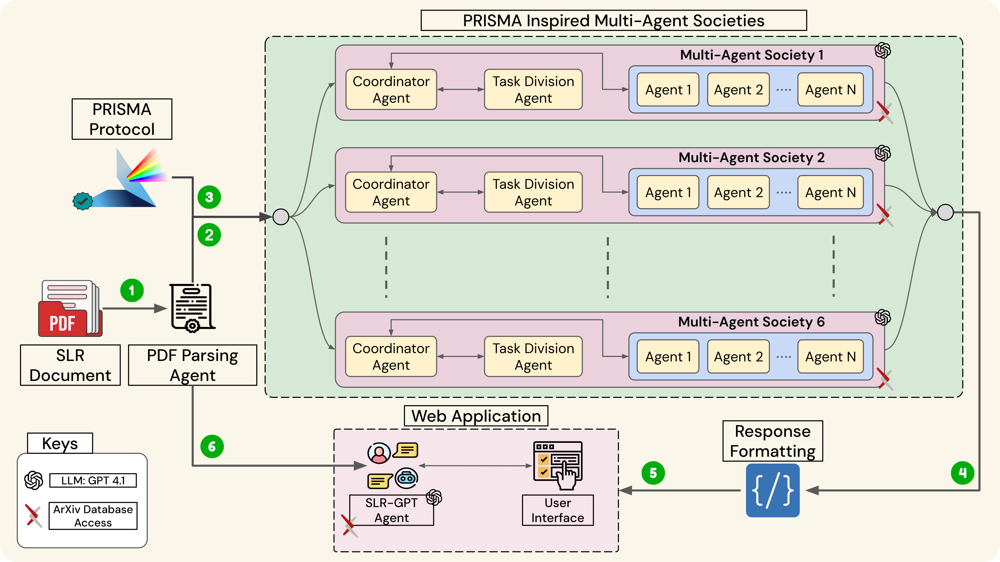

# Can Agents Judge Systematic Reviews Like Humans? **Evaluating SLRs with LLM-based Multi-Agent System**

   

[**Abdullah Mushtaq**](https://github.com/AbdullahMushtaq78), Muhammad Rafay Naeem, Ibrahim Ghaznavi, Alaa Abd-alrazaq, Aliya Tabassum, Junaid Qadir  

---

This repository hosts the **work-in-progress code** and resources for the paper.
The project introduces a novel **Multi-Agent System (MAS)** powered by LLMs to evaluate Systematic Literature Reviews (SLRs) in accordance with **PRISMA guidelines**. It facilitates automated, structured, and interactive evaluation of SLR documents for both authors and reviewers.

> ⚠️ **Work-in-progress:** Some features may be under development, and minor bugs could be present.  
> For the latest deployment, code, and instructions, switch to the [deployed_app branch](https://github.com/AbdullahMushtaq78/GENAI-SLR-TOOL/tree/deployed_app).

---

## 🏗 System Architecture

### Architecture Diagram

  
*Figure: System architecture integrating multiple agents for automated SLR evaluation.*

The MAS-LLM SLR Evaluation Framework consists of **six specialized agent societies** plus standalone utility agents. Each society contains multiple agents responsible for evaluating specific sections of an SLR document. The system workflow ensures structured evaluation, comprehensive scoring, and actionable feedback.

### Society Structure

| Society | Purpose | # of Agents |
|--------|---------|------------|
| **Abstract & Title** | Ensures accurate and concise abstracts and titles following PRISMA guidelines | 2 |
| **Introduction** | Evaluates rationale, background, and research objectives | 2 |
| **Methods** | Assesses methodological rigor, reproducibility, search strategies, bias evaluation, and synthesis methods | 11 |
| **Results** | Reviews reporting of results, tables, and visualizations | 7 |
| **Discussion** | Analyzes interpretation of results, limitations, and broader implications | 1 |
| **Other Information** | Checks transparency, ethics, registration, funding, conflicts of interest, and data sharing | 4 |
| **Stand-Alone Agents** | Handles utility tasks like PDF parsing and follow-up conversation | 2 |

---

### Workflow Overview

1. **Document Upload:** Users upload SLR PDFs to the system.  
2. **Preprocessing:** PDF is converted into structured text using [Unstructured.io](https://unstructured.io/).  
3. **Input to Societies:** Text is distributed to the six specialized agent societies.  
4. **Task Coordination:** Each society has a **Coordinator Agent** and **Task Agent** that assign tasks to individual agents.  
5. **Agent Evaluation:** Agents process their assigned sections based on PRISMA-aligned checklists.  
6. **Society-Level Aggregation:** Coordinator compiles outputs from all agents in the society.  
7. **Final Output Generation:** Consolidated structured evaluation is generated.  
8. **User Interaction:** Results are presented via a **web-based interface** and a **Follow-up Conversation Agent (SLR-GPT)** enables interactive queries.

---

## 🛠 Features

- **Automated SLR Evaluation:** Checks PRISMA compliance and methodological rigor.  
- **Multi-Agent Collaboration:** 27 agents across societies with task decomposition and coordination.  
- **Interactive Follow-up:** Chatbot allows users to ask clarifying questions.  
- **PDF Parsing:** Converts uploaded PDFs into structured textual data.  
- **Structured Reports:** Generates a comprehensive evaluation with suggestions for improvements.  

---

> This repository is intended for research and educational purposes.
